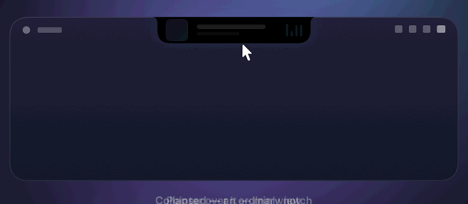
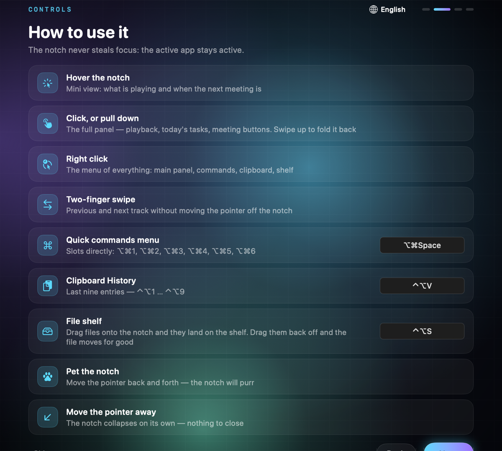

# Trunook

[Русский](README.md) · [English](README.en.md) · **简体中文**

MacBook 的动态刘海：音乐、会议、剪贴板历史、文件架，以及向本地模型提问——
都在刘海里完成，而不是散落在各个窗口。



把光标移到刘海上，它会显示正在播放的内容和下一场会议。点按或向下轻扫，
面板完整展开。右键打开全部功能菜单。



## 功能

- **音乐。** 曲目、封面、播放控制，以及沿岛屿轮廓的播放进度线。适用于任何
  播放器：数据来自系统。两指轻扫即可切换曲目。
- **日历与提醒。** 在你选定的时间提前提醒，会议链接一键加入，刘海里显示
  倒计时。还能显示 Things 3 里今天的任务。
- **会议控制。** 通话进行时，悬停即可控制麦克风、摄像头、屏幕共享、举手和
  退出。支持浏览器中的 Telemost、Google Meet、Zoom 和 Teams。
- **剪贴板历史。** 保存最近的复制内容，可用键盘按编号粘贴。
- **文件架。** 把文件拖到刘海上就会落到文件架。再拖到任意窗口即可取出，
  文件会被移走。
- **模型提问。** 使用你自己电脑上的 Ollama：回答直接写在刘海里，可以复制或
  粘贴到当前窗口。
- **快捷命令。** 六个带快捷键的槽位：应用、文件夹、链接、AppleScript、
  模型提问，或 macOS「快捷指令」。
- **天气与电源。** 面板角落显示温度图标，天气变化或接上电源时弹出提示。

界面提供俄语、英语和中文，默认跟随系统。

## 安装

### 从源码构建 —— 更省事的方式

```bash
git clone https://github.com/TruDevLab/Trunook.git
cd Trunook
make cert      # 一次性：生成自签名证书
make install   # 构建、签名并放入「应用程序」
```

需要 Command Line Tools（`xcode-select --install`），不需要 Xcode。

### 使用预编译镜像

从[发布页](../../releases)下载 `.dmg`，把应用拖进「应用程序」，然后清除
隔离标记：

```bash
sudo xattr -r -c /Applications/Trunook.app
```

## 限制

### 没有 Apple 签名

本项目没有付费开发者账号。在别人的 Mac 上门禁不会放行（`spctl -a` 返回
`rejected`），无法公证，也不会上架 App Store。上面的安装顺序正因如此：从源码
构建更省事——你用自己的证书构建的东西，系统不会为难；用镜像则需手动清除隔离
标记。

### 辅助进程使用了 Apple 的命名空间

macOS 通过私有的 `MRMediaRemoteGetNowPlayingInfo` 提供当前曲目信息，而从
macOS 15.4 起普通进程只能拿到空值：只有标识符为 `com.apple.controlcenter.*`
的进程仍可访问。XPC 辅助进程因此得名
`com.apple.controlcenter.TrunookHelper`。

这个做法不会访问他人的数据——它解除的是读取你自己播放器状态的限制。Apple
随时可能在更新中堵上：届时只有曲目名称会消失，绕行本身被隔离在独立服务里。

## 哪些数据会离开你的 Mac

- **天气**——精确到百分之一度（约一公里）的坐标会发送到 open-meteo.com。
  这是整个应用唯一的联网请求。
- **模型提问**发往你自己电脑上的 Ollama。
- **剪贴板历史和文件架**都留在本机：历史存在应用自己的文件里，文件架只是
  指向你文件的引用。

## 系统要求

- 带硬件刘海的 MacBook。应用不会显示在外接显示器上。
- macOS 14 或更高版本。
- 构建需要 Command Line Tools。
- 模型提问需要单独安装 [Ollama](https://ollama.com)。

## 开发

内部结构、踩坑记录和调试方法见
[DEVELOPMENT.md](DEVELOPMENT.md)（俄语）。

```bash
make run    # 构建、安装并启动
make test   # 测试
make dmg    # 磁盘镜像
```

## 许可证

[MIT](LICENSE)。
